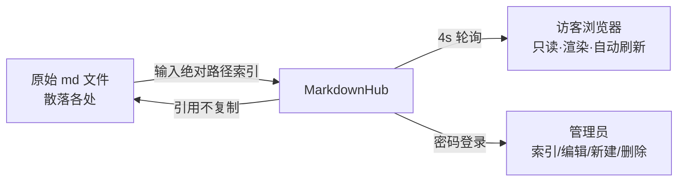

# MarkdownHub 项目报告：进度与调研结论

> 日期：2026-09-04 ｜ 状态：实现完成（11/11 tickets），code-review 修复完毕，待人工验收
> 本文件是 MarkdownHub 的第一个共享文档，用于验收"索引原始路径 + 渲染 + 内网访问"全链路。

## 一、调研结论（先说答案：为什么自建）

对 20+ 现成开源方案做了一手来源核查（官方文档/源码/Release），完整报告见
`docs/research/markdown-share-service-options.md`（27.8K，含逐条引用）。核心结论：

**关键事实**

1. **需求与生态根本错位**：本项目最核心的需求 R1——"在界面上动态输入任意本地路径索引文件/目录"——**在所有现成工具中零支持**。它们全部是"启动时用参数/环境变量指定一个固定根目录"的模型。
2. **DB 系全部出局**：Outline、BookStack、Docmost、HedgeDoc、Cowyo 等内容存数据库，与原始文件脱钩，违背"引用原始路径、文件留在原处"。
3. **读盘模型不符**：Gollum 走 git 对象库（外部改文件不 commit 就不可见）；Wiki.js 以 DB 为准、本地目录只能单向导出；mdBook 源码对 src 外路径直接 panic。
4. **平台约束**：CentOS 7 (glibc 2.17) 上官方 Node 18+ 二进制不可用；Go/musl/Python 无此障碍。

**推荐排名**

| 排名 | 方案 | 满足度 |
|---|---|---|
| 1 | **自建薄后端 + 本地化前端渲染**（已采用） | 唯一 100% 满足的路径 |
| 2 | wikmd（Python/Flask，现成最贴合） | R2–R5 全满足，R1 缺失（目录启动时固定） |
| 3 | mo（Go 单二进制，纯只读） | 无认证，需反代补齐 |

**结论**：自建。增量成本低（本项目实际约一天完成 11 张票），且调研过程反证了 R1 是生态空白而非重复造轮。

## 二、实现进度：11/11 tickets 全部完成

```
01 骨架与启停        ✅  Flask + nohup 启停 + pytest harness
02 访客只读闭环      ✅  registry + 渲染页（markdown-it + highlight.js）
03 目录索引树形      ✅  递归扫描 + 排除规则 + 即时过滤
04 相对资源服务      ✅  子树/同目录边界 + 防穿越
05 轮询实时刷新      ✅  4s mtime+size 轮询，源丢失标记与自动恢复
06 mermaid/KaTeX    ✅  全部本地打包
07 管理员认证        ✅  PBKDF2 + set_password + session 守卫
08 索引管理          ✅  界面加/取消索引、源丢失语义
09 在线编辑          ✅  CodeMirror 5 + 写回 + 自动备份（保留 10 份）
10 workspace 删除语义 ✅  来源判定：服务新建真删 / 外部仅松绑
11 端到端验收        ✅  真实环境全链路（API 层）
```

**质量数据**：69 个 pytest（HTTP seam）+ node 渲染冒烟全绿；13 次提交。

**code-review 闭环**：审查发现 10 条问题全部修复（commit c7476c4），其中 3 条致命——
目录文档前端 URL 丢子路径（主用例 100% 坏）、符号链接越界未授权读（安全）、删除语义按位置误判。
修复均有回归测试锁定。

## 三、部署形态

- **端口** `18123`，监听 `0.0.0.0`（内网可直接访问）
- 启动 `./start.sh`（nohup，日志 `logs/`，pid `data/mdhub.pid`）；停止 `./stop.sh`
- 依赖仅 Python 3.9 + Flask 单包；全部前端资产本地打包，**内网无外网机器可用**
- 首次部署需执行 `python -m mdhub.cli set_password` 设置管理员凭证

## 四、待人工验收清单（自动化覆盖不了的部分）

1. **浏览器全流程**（最高优先级——E2E 只覆盖了 API 层，JS 行为需真人走查）
   - 从列表点进目录条目下的子目录文档，确认能正常渲染（对应 code-review 致命修复 #1）
   - 管理员登录后确认列表项出现"删除/取消共享"按钮（修复 #3）
   - 在线编辑：改一段保存 → 不刷新页面等 4 秒确认自动更新 → data/backups/ 出现备份
2. **另一台内网机器访问** `http://10.41.167.37:18123`，确认列表与文档可达
3. **断外网**（或屏蔽 CDN）刷新页面，确认图表/公式/高亮/编辑器全部正常（零外链验证）
4. **实时性体感**：在服务器上直接改一个被索引的 md 文件，确认页面 4 秒内自动变化
5. **渲染质量抽查**：本文档包含表格、代码块、mermaid、公式，都是现成的验收样例
6. **改密**：部署用的临时密码应尽快用 `set_password` 更换

## 五、本文档自带的三验收点

- 你现在能在浏览器里读到这段文字 → 索引原始路径 + 渲染 + 内网访问 ✅
- 页面出现 mermaid 流程图与下方公式 → 本地打包渲染 ✅
- 在服务器上 `echo 追加 >> <本文件路径>` 后页面 4 秒内出现新行 → 轮询实时性 ✅



$$\text{运维成本} = \text{pip install flask} + \text{set\_password} + \text{./start.sh}$$
